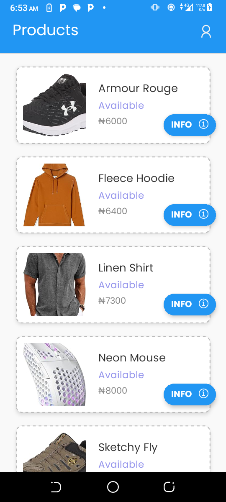
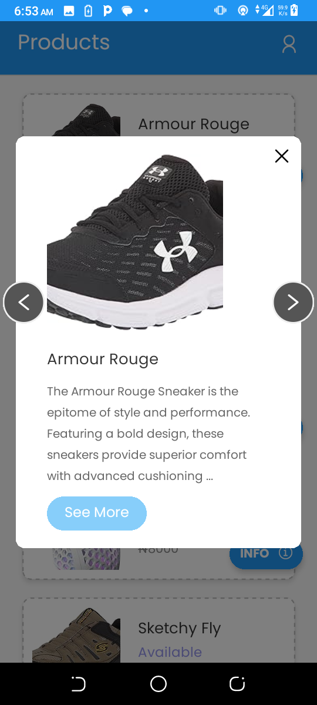

# Product Shopping App



## Author

**Favour Ejiofor**

## Stack

- React Native

## Appetize.io Demo

You can view a live demo of the app on Appetize.io:

[Live Demo](https://appetize.io/app/4khq7tkfxwxbuvcesdxyhnj5za?device=pixel7&osVersion=13.0)

## APK Download

To install the app on your Android device, download the APK from the link below:

[Download APK](https://drive.google.com/file/d/1DzLmz04844C_eXEa2f79IXTZAxcEHWIi/view?usp=drive_link)

## Screenshots

### Product List


### Product Info


### Expanded Product Info


## App Information

The Product Shopping App is designed to provide users with a seamless shopping experience. Built using React Native, it features a clean and modern UI with a focus on simplicity and usability. The app fetches product data from the Timbu API and displays it in an intuitive manner.

### Key Features

- **Product Listing**: Browse through a variety of products with detailed information.
- **Product Info Modal**: View more details about a product in a modal, including price, availability, and description.
- **Navigation**: Use arrow buttons within the modal to cycle through products without leaving the view.
- **Responsive Design**: Optimized for both Android and iOS devices.
- **Light Theme**: The app uses a light UI theme with the Poppins font for a modern look.

## Setup Instructions

To set up the app locally, follow the instructions below:

### Prerequisites

- Node.js (v14 or later)
- npm or yarn
- Expo CLI

### Installation

1. **Clone the Repository**:
   ```sh
   git clone https://github.com/yourusername/product-shopping-app.git
   cd product-shopping-app
   ```

2. **Install Dependencies**:
   ```sh
   npm install
   ```
   or
   ```sh
   yarn install
   ```

3. **Start the Expo Server**:
   ```sh
   npx expo start
   ```

4. **Run on Your Device**:
   - Scan the QR code generated by Expo CLI using the Expo Go app on your Android or iOS device.

### Project Structure

The project follows a standard React Native structure with a focus on modularity and reusability. Key directories and files include:

- **`/assets`**: Contains fonts and images.
- **`/components`**: Reusable UI components.
- **`/context`**: Context providers for state management.
- **`/screens`**: Screen components for different app views.
- **`App.js`**: Entry point of the app.

### Important Files

- **`ProductContext.jsx`**: Context provider for managing product data.
- **`index.jsx`**: Main screen component displaying the product list and handling modal views.

## Usage

Once the app is running, you can:

- Browse through the product list.
- Tap on the "INFO" button to view more details about a product in a modal.
- Use the arrow buttons in the modal to navigate between products.
- Tap "See More" to expand the product description or "See Less" to collapse it.

## Contribution

If you'd like to contribute to the project, please follow these steps:

1. Fork the repository.
2. Create a new branch (`git checkout -b feature/your-feature-name`).
3. Make your changes and commit them (`git commit -m 'Add some feature'`).
4. Push to the branch (`git push origin feature/your-feature-name`).
5. Open a pull request.